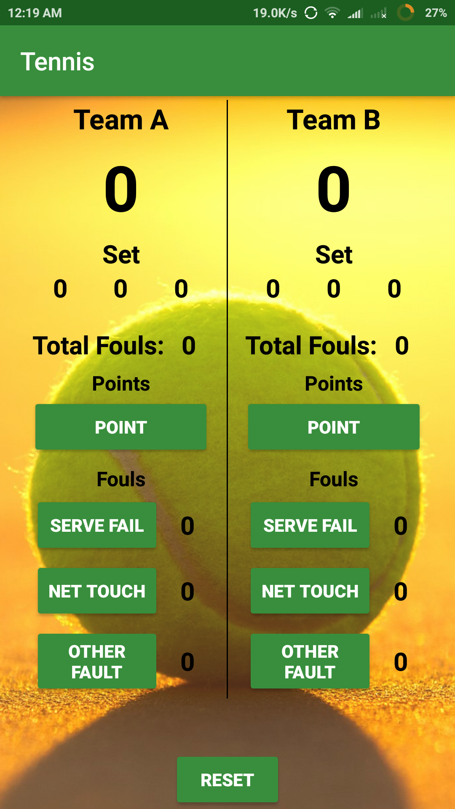
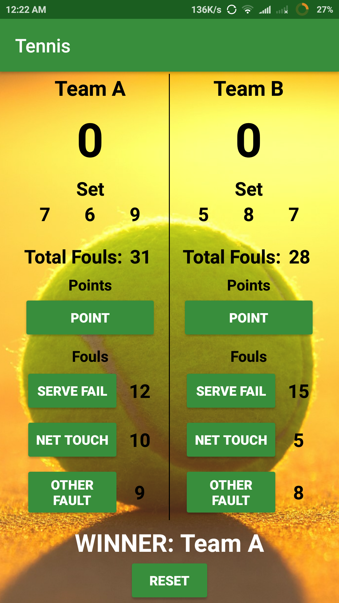
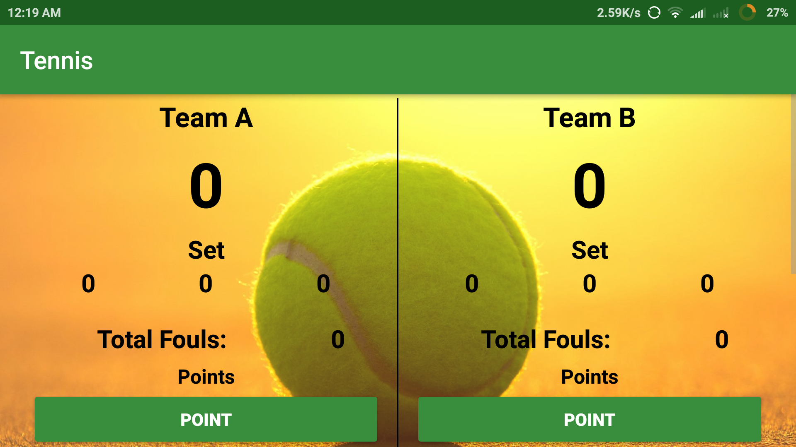
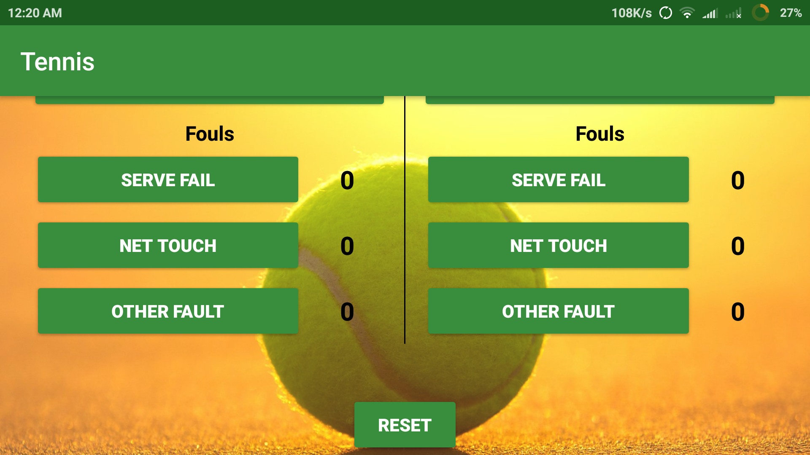

# Udacity and Google India Scholarship Program
## Android Basics Nanodegree Project 2 "Score Keeper App"

### Name of App - "Tennis"

The app has two teams "Team A" and "Team B"
It's a 3 set game. The team which will win 2 sets will be the winner.
The app keeps track of 
- Total Score
- Total Fouls
- Individual Fouls ( Due to net touch, serve fail, other foul)
- Number of sets won by each team.

It will display Winners message at the end.

On pressing Reset button, all the score will be set to zero (0) and the scoring will begain from start.

## Tennis App Images
### Portrait
 

### Landscape
Used ScrollView so that the whole app is accessible with device having smaller screen size and even in Landscape mode.

